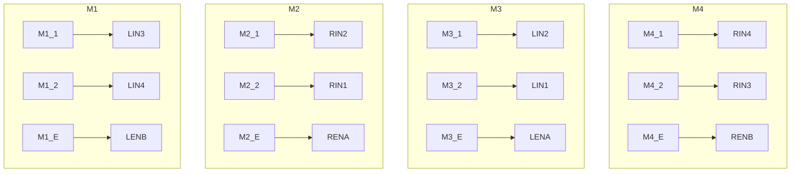

# BT_Car

蓝牙控制的四轮小车，没什么特别的。主要是和信息技术部门合作的。

***

## TODO
+ [ ] 制定一套串口通讯标准
+ [x] ~~供电不够用啊大哥，不可能拖根线到处跑啊喂(((~~
+ [ ] 串联了四节18650电池，电源是够了，但是没法充电啊
+ [ ] 两边的轮子好像转速不一样，走直线会偏
+ [ ] 增加命令队列或者强制执行符号，比如`#`。
+ [ ] 需要避免单线程堵塞，，，**目前打算先用freertos试试看，不好用的话再换呗**
+ [ ] 如果可以实现4个以上的多线程的话，可以把每一个轮子的运动状态分别用一个进程来控制
+ [ ] 最好能做个电量检测，防止18650过放电。
+ [ ] 出大问题，没办法很好地转向，似乎是4个轮子不协调导致的，但是调试了很久也没什么好办法

***

## 相关模块介绍

### 硬件部分

**接线图**

**单片机**采用的是Arduino Nano ，之所以用这款单片机有两个原因，我本人不太会耍STM32，并且之前那个STM32被我烧了qwq  
单片机的**底板**是我自己瞎画的，主要是方便插线和扩展，因为5V和接地总是不够用，而且我加了个typec的口子，这样烧程序的时候就会比较舒服。  
**驱动电机的模块**是已经买好的两个L298N，单独一块板子可以控制两个电机，两块板子就可以控制4个电机，岂不美哉？  
**供电**~~不直接插着电源是跑不起来的，这个列入TODO。~~供电现在采用4节18650串联，通过L298N自带的5V输出给单片机供电，最好能做个电量检测，防止18650过放电。  

### 软件部分

这个库文件我是根据一个现成的改的，原本的只能支持到2路电机，我给改成4路了，这样就可以变成四驱小车了  
这个单片机要做的事情很简单，收到串口发来的指令，只要照着做就行了。  
对了，烧程序的时候必须把蓝牙模块断开，因为串口是共用的。  
需要避免单线程堵塞，，，  

## UserGuide.md

关于如何使用蓝牙串口来控制小车，请阅读：[串口指令文档](https://gitlab.dustella.net/discodyer/bt_car/-/blob/master/UserGuide.md)