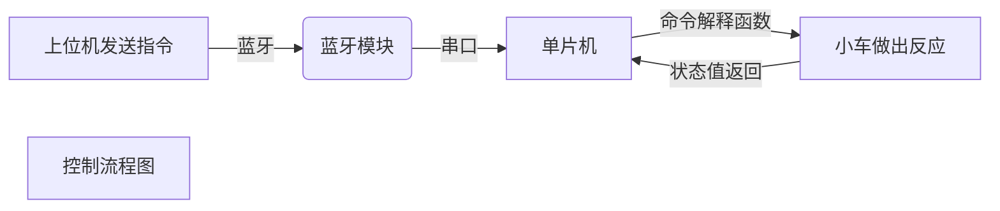

## 串口指令文档

# 简介

控制这个小车是通过<abbr title="也就是uart，是一种通信接口，串口的波特率默认运行在9600。蓝牙串口也类似，只不过是通过蓝牙来传输字节流而已。">`串口`</abbr>来实现的，具体一点就是通过<abbr title="也就是uart，是一种通信接口，串口的波特率默认运行在9600。蓝牙串口也类似，只不过是通过蓝牙来传输字节流而已。">`串口`</abbr>输入<abbr title="串口可以抽象为一个终端，而所传输的字符串就相当于终端里的命令。">`字符串`</abbr>来指挥单片机执行相应的<abbr title="也就是单片机内部的函数，单片机里有一个命令解释函数，用来分析所接收的命令并执行相对应的函数，从而控制小车运动。">`内部函数`</abbr>。这个文档是用来解释<abbr title="串口可以抽象为一个终端，而所传输的字符串就相当于终端里的命令。">`字符串`</abbr>的格式和作用的。

* <abbr title="也就是uart，是一种通信接口，串口的波特率默认运行在9600。蓝牙串口也类似，只不过是通过蓝牙来传输字节流而已。">`串口`</abbr> 也就是uart，是一种通信接口，串口的波特率默认运行在9600。蓝牙串口也类似，只不过是通过蓝牙来传输字节流而已。

* <abbr title="串口可以抽象为一个终端，而所传输的字符串就相当于终端里的命令。">`字符串`</abbr> 串口可以抽象为一个终端，而所传输的字符串就相当于终端里的命令。

* <abbr title="也就是单片机内部的函数，单片机里有一个命令解释函数，用来分析所接收的命令并执行相对应的函数，从而控制小车运动。">`内部函数`</abbr> 也就是单片机内部的函数，单片机里有一个命令解释函数，用来分析所接收的命令并执行相对应的函数，从而控制小车运动。

* <abbr title="也就是控制端，在本项目里就是手机上的控制器，用来发送指令。">`上位机`</abbr> 也就是控制端，在本项目里就是手机上的控制器，用来发送指令。



这个小车有4个轮子，代码中分别用`A` `B` `C` `D`来区分四个轮子，就像这样：

```
         ↑Front↑            //A是左前方的轮子
      ┌----------┐          //B是右前方的轮子
   A ▤│M1     M2│▤ B       //C是左后方的轮子
      │          │          //D是右后方的轮子
      │          │
      │          │
   C ▤│M3     M4│▤ D
      └----------┘       
```


# 语句格式

单片机每接收到一句<abbr title="串口可以抽象为一个终端，而所传输的字符串就相当于终端里的命令。">`字符串`</abbr>就会在内部分析字符串的合法性和所对应的<abbr title="也就是单片机内部的函数，单片机里有一个命令解释函数，用来分析所接收的命令并执行相对应的函数，从而控制小车运动。">`内部函数`</abbr>，并执行一个<abbr title="也就是单片机内部的函数，单片机里有一个命令解释函数，用来分析所接收的命令并执行相对应的函数，从而控制小车运动。">`内部函数`</abbr>(也就是字符串对应的任务)，并且返回一个<abbr title="这里返回的字符串是状态代码">`字符串`</abbr>来反馈指令的运行状态(是否运行成功)。

## 命令主要格式

* `$` 命令开始符号。

* `*` 命令结束符号。

* `,` 用于隔开命令和参数。语句中不应该出现空格` `，而应该用符号`,`表示分隔。

* `@` 用来代表参数缺省，具体请看下面列表，参数如果支持缺省会用@表示

每一条命令都由符号`$`表示开始，并由符号`*`表示一句命令的结束。

基本格式：

```
$命令,参数,参数,参数*
↑ ┬  ↑ ┬           ↑
│ │  │ │           └─命令结束符号，代表了一行命令的结束
│ │  │ └─参数有些是必须的，而有些是不必须的。如果必须的值缺省的话，会使用默认值，或代表不同的`内部函数`。
│ │  └─`,`是作为命令和参数之间的间隔，用来区分的。
│ └─命令代表了内部函数，能让小车做出反应。有些函数必须提供参数，而有些不是必须的。
└─`$`是命令开始符号，如果小车接收到`$`的时候上一个函数没有执行完，会强制终止当前函数||Todo:增加命令队列或者强制执行符号，比如`#`。

```

## 主要命令

| 命令 | 参数 | 示例 | 备注 |
| :-----| :----- | :----- | :----- |
| `F` | <abbr title="范围0~255，默认80">`SPEED`</abbr> , <abbr title="单位是ms，1000=1s,默认在中断前不会停止">`TIME`</abbr> | <abbr title="速度80，不停止">`$F,@,@*`</abbr> / <abbr title="和[$F,@,@*]等价">`$F*`</abbr> | 前进 |
| `B` | <abbr title="范围0~255，默认80">`SPEED`</abbr> , <abbr title="单位是ms，1000=1s,默认在中断前不会停止">`TIME`</abbr> | <abbr title="速度80，不停止">`$B,@,@*`</abbr> / <abbr title="和[$B,@,@*]等价">`$B*`</abbr> | 后退 |
|  |  |  |  |
|  |  |  |  |
|  |  |  |  |
|  |  |  |  |
|  |  |  |  |
|  |  |  |  |
|  |  |  |  |
|  |  |  |  |
|  |  |  |  |
|  |  |  |  |
|  |  |  |  |
